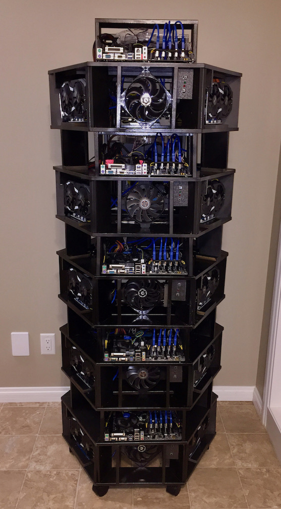
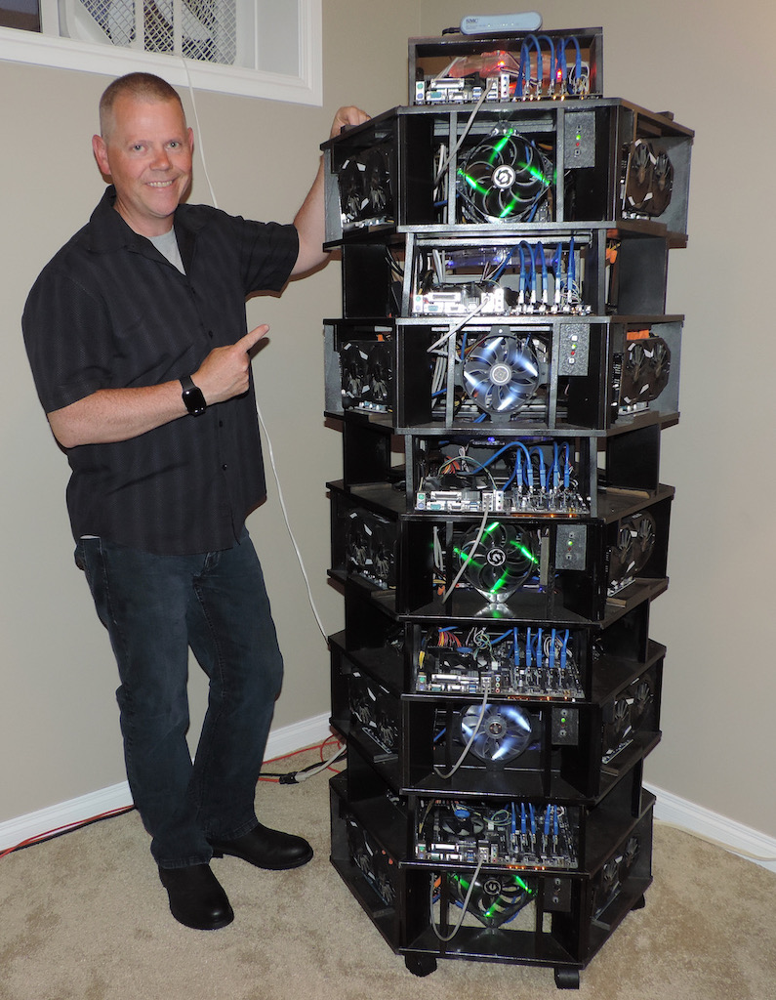

Mining

 
  
I constructed this computing tower using off the shelf computer parts, including 25 AMD Radeon RX580 Graphics processing units (GPU's) which handle the task of processing the mathematical algorithms that verify digital currency transactions and generate new cryptocurrency in the process.  I designed the enclosure in 5 separate, stackable segments, each one having a hexagonal footprint.  This provided optimum cooling for each GPU and allowed individual segments to be removed for maintenance or repair as necessary, while allowing the other segments to continue operating, reducing down time.

  
  

  

I constructed this computing tower using off the shelf computer parts, including 25 AMD Radeon RX580 Graphics processing units (GPU's) which handle the task of processing the mathematical algorithms that verify digital currency transactions and generate new cryptocurrency in the process.  I designed the enclosure in 5 separate, stackable segments, each one having a hexagonal footprint.  This provided optimum cooling for each GPU and allowed individual segments to be removed for maintenance or repair as necessary, while allowing the other segments to continue operating, reducing down time.

